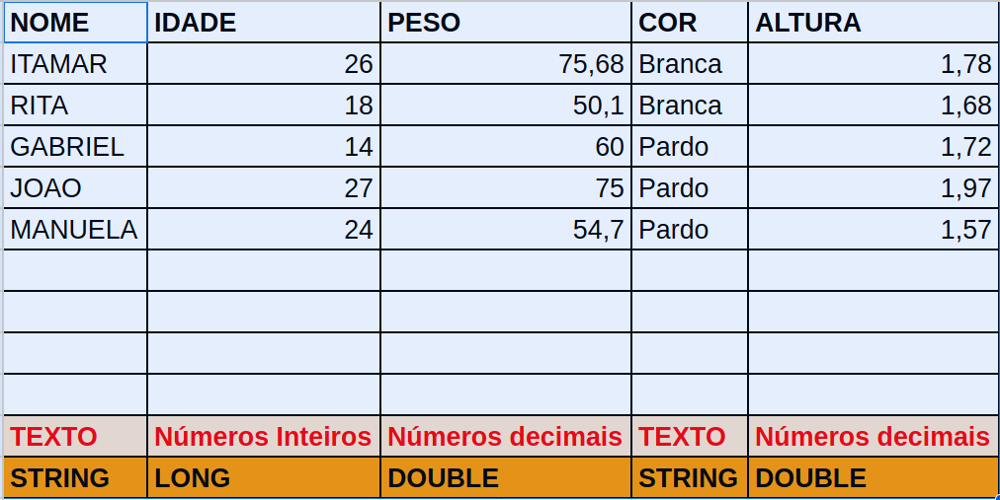

# Modificador de acesso:
 - public (FULL - todo mundo mete a mão)
 - protected (OPA - só a familia)
 - private - (NÃO - só a classe)

# Vida real
 - Numeros inteiros
 - Numeros decimais
 - Textos
 - Datas
 - Verdadeiro/Falso
 - Horas

# Vida não real
 - TEXTO (String, char[])
 - Numeros Inteiros (int, Integer, Long)
 - Numeros decimais (double, Double, Float, BigDecimal)
 - Datas (Date, Timestamp)
 - Horas (Hour, Timestamp)
 - (true)Verdadeiro/Falso(false) (boolean, Boolean)

# Exemplo:


# Operadores Básicos em Java

Este arquivo contém exemplos e explicações sobre os operadores básicos na linguagem de programação Java.

## Operadores Aritméticos em Java

Os operadores aritméticos em Java são usados para realizar operações matemáticas entre variáveis.

- `+` (adição)
- `-` (subtração)
- `*` (multiplicação)
- `/` (divisão)
- `%` (resto da divisão)

## Exemplo:

```java
int a = 10;
int b = 5;

int soma = a + b;   // soma = 15
int subtracao = a - b;   // subtracao = 5
int multiplicacao = a * b;   // multiplicacao = 50
int divisao = a / b;   // divisao = 2
int resto = a % b;   // resto = 0
```

## Operadores Relacionais em Java

Os operadores relacionais em Java são usados para comparar dois valores e determinar a relação entre eles. Eles retornam um valor booleano que indica se a relação é verdadeira ou falsa.

- `==` (igual a)
- `!=` (diferente de)
- `>` (maior que)
- `<` (menor que)
- `>=` (maior ou igual a)
- `<=` (menor ou igual a)

## Exemplo:

```java
int x = 10;
int y = 5;

boolean igual = x == y;   // igual = false
boolean diferente = x != y;   // diferente = true
boolean maiorQue = x > y;   // maiorQue = true
boolean menorQue = x < y;   // menorQue = false
boolean maiorOuIgual = x >= y;   // maiorOuIgual = true
boolean menorOuIgual = x <= y;   // menorOuIgual = false

```

## Operadores Lógicos em Java

Os operadores lógicos em Java são usados para realizar operações booleanas entre expressões. Eles retornam um valor booleano que indica se a operação é verdadeira ou falsa.

- `&&` (E)
- `||` (OU)
- `!` (NÃO)

## Exemplo:

```java
boolean a = true;
boolean b = false;

boolean resultadoE = a && b;   // resultadoE = false
boolean resultadoOu = a || b;   // resultadoOu = true
boolean resultadoNaoA = !a;   // resultadoNaoA = false
boolean resultadoNaoB = !b;   // resultadoNaoB = true
```

## Operadores de Atribuição em Java

Os operadores de atribuição em Java são usados para atribuir valores a variáveis. Eles também podem combinar uma operação com a atribuição.

- `=` (atribuição simples)
- `+=` (adiciona e atribui)
- `-=` (subtrai e atribui)
- `*=` (multiplica e atribui)
- `/=` (divide e atribui)
- `%=` (calcula resto e atribui)

## Exemplo:

```java
int x = 5;

x += 3;   // x = 8
x -= 2;   // x = 6
x *= 4;   // x = 24
x /= 3;   // x = 8
x %= 5;   // x = 3
```
