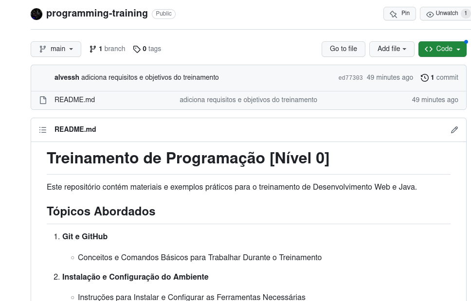

## Exemplo.md

Este é um exemplo de arquivo Markdown (.md) para ilustrar como podemos utilizar a formatação de texto para documentar nossos projetos.

### Tópicos Abordados:

- **Markdown**
  - Introdução ao Markdown
  - Formatação de Texto
  - Listas
  - Links
  - Imagens
- **Código**
  - Inserção de Código
  - Destaques de Sintaxe
- **Blocos de Citação**
- **Tabelas**

### Markdown

O Markdown é uma linguagem de marcação leve que facilita a formatação de texto de forma simples e legível.

### Formatação de Texto

É possível **negritar** ou *italizar* palavras e frases. Também podemos criar listas numeradas ou com marcadores:

1. Item 1
2. Item 2
   - Subitem 2.1
   - Subitem 2.2

### Links

Podemos inserir [links](https://www.exemplo.com) para páginas web.

### Imagens

Também é possível adicionar imagens:



### Código

Podemos incluir trechos de código inline, como `var exemplo = true`, ou blocos de código:

```python
def exemplo():
    return "Olá, mundo!"

```

### Blocos de Citação

Para criar um bloco de citação em Markdown, utilize o sinal de maior que (>). Por exemplo:

> Isso é um exemplo de bloco de citação.

Blocos de citação são úteis para destacar informações importantes ou citar textos de outras fontes.

| Coluna 1 | Coluna 2 |
| -------- | -------- |
| Dado 1   | Dado 2   |
| Dado 3   | Dado 4   |


Este arquivo `.md` ilustra diferentes elementos de formatação disponíveis em Markdown.
